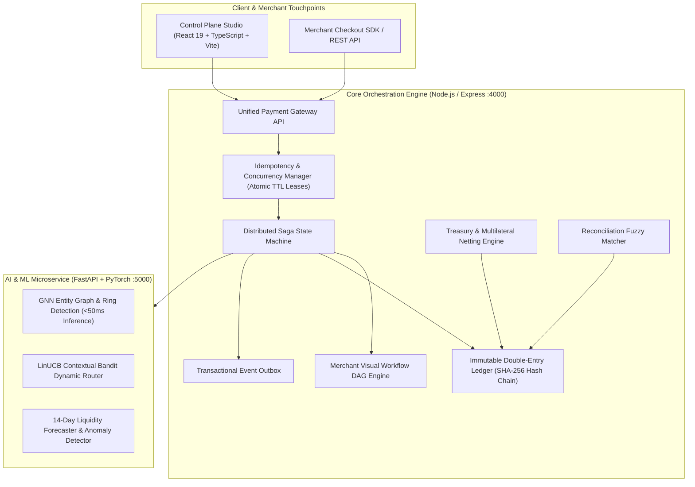

# LedgerPay AI – Intelligent Payment Orchestration & Multi-Currency Treasury

**One-liner:** An enterprise payment orchestration gateway that guarantees financial consistency under high concurrency, powered by AI Graph Neural Networks for real-time fraud ring detection, Contextual Bandit reinforcement learning for dynamic provider routing, multilateral netting treasury management, and an immutable cryptographic double-entry ledger.

---

## Architecture Overview



---

## Core Capabilities

### 1. Concurrent Payment & Idempotency Engine
- **Atomic Concurrency Leases**: Prevents race conditions and double-charging by acquiring atomic locks per `(merchant_id, idempotency_key)` with TTL expiration.
- **Deterministic Replay**: Duplicate requests return identical cached responses without side-effects or re-triggering ledger debits.
- **Concurrency Stress Test**: Firing 10 concurrent requests simultaneously produces exactly **1 settled transaction** and **9 rejected with 409 Conflict**, resulting in 0 double charges.

### 2. AI-Powered Fraud Ring Detection (GNN)
- **Heterogeneous Entity Graph**: Dynamic topology of Users, Cards, Devices, IPs, and Merchants modeled in NetworkX and PyTorch.
- **GraphSAGE Message Passing**: Aggregates 2-hop neighbor embeddings to detect card-spinning rings, anonymizer proxy clusters, and device collisions under **50ms**.
- **Dynamic 3DS / SCA Recommendation**:
  - Score `0-25`: Frictionless flow (SCA exempt).
  - Score `26-79`: 3DS Step-Up Challenge (biometric / OTP challenge).
  - Score `80-100`: Immediate block and abort before provider authorization.

### 3. Reinforcement Learning Smart Provider Routing
- **LinUCB Contextual Bandit**: Selects the optimal provider arm (`stripe`, `adyen`, `paypal`, `checkout_com`) balancing authorization win rate, processing fee schedules, and API latency.
- **Online Learning**: Updates policy matrices ($A_a, b_a$) immediately upon transaction settlement.
- **Saga Fallback Resilience**: If the primary provider returns an issuer decline or timeout, the saga automatically retries with the contextual bandit's backup provider.

### 4. Multi-Currency Treasury & Multilateral Netting
- **Real-Time FX Feed**: Live interbank mid-rates with spreads and provider markups for USD, EUR, GBP, JPY, CAD, and SGD.
- **Atomic Currency Conversion**: Debits foreign payable liability and credits base payable with optimistic balance version checking to prevent double-spend.
- **Multilateral Netting Engine**: Compresses bilateral merchant obligations into net wire settlements, achieving **76.3% volume reduction** and significant savings on wire and FX fees.
- **14-Day Liquidity Forecaster**: Time-series forecast of currency inflows/outflows with automated hedging recommendations.

### 5. Immutable Cryptographic Double-Entry Ledger
- **Strict Invariant**: `sum(debits) === sum(credits)` enforced atomically on every journal entry.
- **SHA-256 Hash Chaining**: Every entry links to the previous entry's cryptographic hash, allowing full mathematical auditability from genesis to tip.

### 6. Merchant Visual Workflow Engine
- **Visual DAG Rule Builder**: Merchants define custom routing policies, 3DS step-up thresholds, and auto-retry rules compiled to JSON DAGs.

### 7. Bank & Provider Reconciliation
- **Fuzzy Matcher**: Matches internal ledger entries against provider statements by external reference, amount tolerance, and timestamp proximity.
- **Anomaly Detection**: Flags ghost provider settlements, fee surcharges, and unsettled charges with statistical outlier scores.

---

## Quick Start & Running Locally

### Prerequisites
- Node.js v20+
- Python 3.10+ (PyTorch, FastAPI, NetworkX, Scikit-Learn installed)

### Services Setup

```bash
# 1. AI Service (Python FastAPI :5000)
cd ai-service
python app.py

# 2. Core Orchestrator (Node.js/Express :4000)
cd backend
npm install
npx tsx src/server.ts

# 3. Control Plane UI (React/Vite :3000)
cd frontend
npm install
npx vite --port 3000 --host 127.0.0.1
```

Open your browser at: `http://127.0.0.1:3000`

---

## Verification & API Testing

### Concurrency & Idempotency Stress Test
```bash
npm run test:concurrency
```
Output:
```json
{
  "concurrentThreads": 10,
  "newLedgerBookingsCreated": 1,
  "doubleChargePrevented": true,
  "conclusion": "PERFECT CONCURRENCY CONTROL: Exactly 1 transaction booked, 0 double-charges under 10 concurrent threads."
}
```

### Cryptographic Ledger Chain Audit
```bash
npm run test:ledger-audit
```
Output:
```json
{
  "isValid": true,
  "checkedCount": 16
}
```
